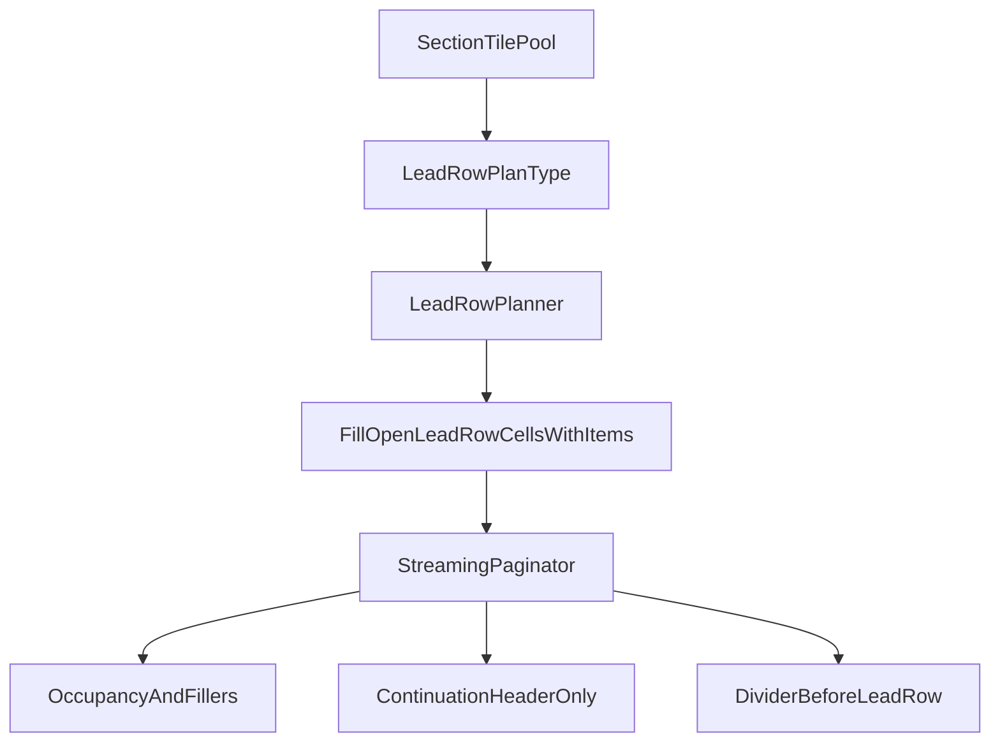

# Feature Tiles Replan

## First-Build Problems To Carry Forward
- The current implementation succeeded as an initial proof of concept, but it inherited two assumptions from the older paginator that now conflict with the intended UX:
  - the body logo is emitted globally before all sections in [`src/lib/templates/v2/streaming-paginator.ts`](src/lib/templates/v2/streaming-paginator.ts)
  - section headers always place as their own row and advance the cursor immediately afterward in [`src/lib/templates/v2/streaming-paginator.ts`](src/lib/templates/v2/streaming-paginator.ts)
- That is why the current build produces the exact issues observed in testing:
  - the logo appears above the first category instead of inside it
  - the 1x1 category header tile remains visually detached from the row it is meant to introduce
  - the flagship behaves like a separate promoted row rather than one candidate tile competing for section space
- The first build also exposes a section-scoping gap: embedded logo tiles currently do not belong to a section in a way the filler manager can reason about, which becomes a bug once logo/header/item tiles share a row.
- This revision should preserve the useful parts already built:
  - the user-facing toggles remain in place in [`src/app/menus/[menuId]/template/template-client.tsx`](src/app/menus/[menuId]/template/template-client.tsx)
  - `showCategoryHeaderTiles` remains the user-facing switch that activates shared-row category header behavior rather than being replaced by a new toggle
  - the future drag-and-drop direction still favors a planner that treats menu items, feature tiles, and spacers as peer body tiles

## Revised Product Rules
- Move from “insert special rows, then fill remaining space with items” to “plan each section as a pool of candidate body tiles, then place them into available cells deterministically”.
- Treat these as first-class body tiles:
  - menu item tiles
  - spacer/filler tiles where the template supports them
  - category header tiles when `showCategoryHeaderTiles` is enabled
  - one embedded logo tile in the first non-empty section only when `showLogoTile` is enabled
  - one flagship tile for the whole menu when `showFlagshipTile` is enabled
- Priority rules:
  - the logo must appear in the first non-empty section if feature tiles are active
  - logo outranks flagship when width is constrained
  - preferred lead-row composition is `logo + header` first, then flagship only if there is room
  - if flagship cannot fit in the lead row, it remains a `FLAGSHIP_CARD` and becomes the first tile on the next row of that section rather than being demoted to a regular item or removed
- Mixed-rowSpan rule:
  - when a lead row contains a taller tile such as `FLAGSHIP_CARD`, the lead row footprint is governed by the max `rowSpan` in that row
  - any unused cells inside that lead-row footprint should be offered first to regular section items before being left to later filler/spacer logic
  - these cells are not dead space and should not be reserved for the filler manager unless there are no regular items available to consume them
- “First non-empty section” means globally across the menu, not per page. The embedded logo never repeats on later pages or later sections.
- Continuation pages repeat only the section header, never the logo or flagship.
- If there are no non-empty sections, the embedded body logo does not render.

## Clarified Header Semantics
- The earlier wording about “same footprint height as the active item mode” was too broad. The safer rule is:
  - keep the category header on its existing YAML-defined `rowSpan` and visual height
  - allow it to participate in a shared lead row by using `colSpan: 1` when `showCategoryHeaderTiles === true`
  - do not enlarge the header to full item-card height in image mode
- This keeps the current template styling in [`src/lib/templates/v2/templates/`](src/lib/templates/v2/templates/) intact while changing placement behavior instead of making section headers visually oversized.

## Lead-Row Planner Model
- Introduce a lead-row planning type in [`src/lib/templates/v2/streaming-paginator.ts`](src/lib/templates/v2/streaming-paginator.ts) or a small helper module that explicitly models:
  - section id
  - whether the row belongs to a normal section start or a continuation section start
  - candidate tiles available for that section start (`logo`, `header`, `flagship`, first regular items)
  - chosen composition for the row
  - remaining queued tiles for the section after the lead row is placed
- The embedded logo tile should carry section ownership metadata when it is emitted into a section lead row so that [`src/lib/templates/v2/filler-manager-v2.ts`](src/lib/templates/v2/filler-manager-v2.ts) can treat that occupied cell as belonging to the section.

## Concrete Placement Rules By Template Width
- `1-column-tall`
  - shared-row composition is impossible
  - when enabled, the logo is emitted at the start of the first non-empty section, followed by the header, followed by flagship or items in normal order
  - spacer behavior remains excluded as today
- `2-column-portrait`
  - logo + header can share the lead row only if both are `colSpan: 1`
  - flagship currently has `colSpan: 2`, so it cannot coexist in that row
  - fallback rule: flagship becomes the first tile on the next row of the same section and retains `FLAGSHIP_CARD`
- `3-column-portrait`
  - default lead-row target is `logo(1) + header(1) + item(1)`
  - flagship does not share the lead row when it requires `colSpan: 2`; it moves to the next row as the section’s first promoted content tile
- `4-column-portrait`
  - default lead-row target is `logo(1) + header(1) + flagship(2)` when flagship is present
  - because flagship is taller, the cells under `logo` and `header` within that two-row lead footprint should be filled by the first regular items if available
  - if no regular items are available, those cells remain empty and are only available to later filler logic
  - otherwise use `logo + header + first items`
- `5-column-landscape`
  - default lead-row target is `logo(1) + header(1) + flagship(2) + first item(1)` when spacing and policy allow
  - if there are fewer regular items than spare columns, fill as many remaining lead-row cells as possible with available items and leave any remaining cells empty for later filler logic
  - if flagship is absent, use `logo + header + first items`
- `6-column-portrait-a3`
  - default lead-row target is `logo(1) + header(1) + flagship(2) + first items(2)` when possible
  - if there are fewer than two regular items available, fill only the available item cells and leave the remaining lead-row cells empty for later filler logic
  - preserve A3-specific row math rather than treating it as equivalent to 4- or 5-column behavior

## Divider, Continuation, And Keep-With-Next Rules
- Dividers remain full-width body tiles and should still place before a section’s lead row when templates enable them.
- The planner must define divider interaction explicitly:
  - divider finishes the previous section
  - next section begins with a fresh lead-row plan
- Refactor the keep-with-next check in [`src/lib/templates/v2/streaming-paginator.ts`](src/lib/templates/v2/streaming-paginator.ts) from “header row + N followers” to “lead row max-span + N followers with partially occupied first-row cells”.
- The new keep-with-next simulation needs to account for:
  - the lead row’s actual height being the max `rowSpan` of its chosen tiles
  - columns already consumed by logo/header/flagship in the first row
  - the fact that the first regular items may start on the same row or the next row depending on available columns
- This is the most complex single part of the rework and should be isolated into a dedicated helper rather than inlined into the existing `canPlaceHeaderWithItems()` flow. The helper should simulate a lead-row footprint, fill any open cells within that footprint with regular items when possible, then continue simulating follower rows until the keep-with-next window is satisfied.
- On continuation pages:
  - repeat only the section header
  - do not rebuild a composite lead row
  - if a new section starts on a continuation page, it still gets its normal section-start lead row except that only the globally first non-empty section ever owns the embedded logo

## Engine Updates
- Replace `buildBodyTileStream()` in [`src/lib/templates/v2/streaming-paginator.ts`](src/lib/templates/v2/streaming-paginator.ts) with a section-aware planning step such as `buildSectionPlans()` or equivalent, then have pagination consume those section plans instead of a flat global stream.
- The replacement should emit:
  - a lead-row plan per section start
  - subsequent flagship/item tiles after that plan is resolved
- Update [`src/lib/templates/v2/tile-placer.ts`](src/lib/templates/v2/tile-placer.ts):
  - keep `resolveSectionHeaderPlacement()` as the source of the `showCategoryHeaderTiles` col-span behavior
  - keep the header’s YAML-defined visual height
  - keep the logo as a `1x1` body tile, but place it through section logic rather than global prefix logic
  - preserve `FLAGSHIP_CARD` type and col-span while applying the concrete “next row” fallback
- Update [`src/lib/templates/v2/filler-manager-v2.ts`](src/lib/templates/v2/filler-manager-v2.ts):
  - make mixed rows deterministic when they contain logo/header/item/flagship combinations
  - honor section ownership for embedded logo tiles
  - ensure spacer insertion does not overlap or misclassify shared rows
- Revisit balancing and centering in [`src/lib/templates/v2/tile-placer.ts`](src/lib/templates/v2/tile-placer.ts) so rows that mix items with header/logo tiles are not treated incorrectly.

## Tests And Regression Coverage
- Replace the outdated expectations in [`src/lib/templates/v2/__tests__/streaming-pagination.test.ts`](src/lib/templates/v2/__tests__/streaming-pagination.test.ts) that explicitly assert:
  - body logo appears before the first section
  - 1x1 section headers always force the first item onto the next row
- Add focused tests for:
  - logo embedded only in the globally first non-empty section
  - no embedded logo when the menu has no non-empty sections
  - `showCategoryHeaderTiles` continuing to govern shared-row header behavior
  - flagship fallback to the next row in `2-column-portrait` and `3-column-portrait`
  - `4-column`, `5-column-landscape`, and `6-column-portrait-a3` lead-row compositions
  - divider followed by a valid section lead row
  - continuation pages repeating only the section header
  - filler/spacer placement remaining non-overlapping in mixed rows
  - embedded logo carrying section ownership for filler-scoped logic

## Implementation Notes
- Keep the UI/config surface already built in [`src/app/menus/[menuId]/template/template-client.tsx`](src/app/menus/[menuId]/template/template-client.tsx); this replan is primarily about engine behavior.
- Avoid overfitting auto-ordering because future within-section drag-and-drop will reduce the need for perfect initial ordering. The planner should produce deterministic, understandable defaults that are easy to override later.

