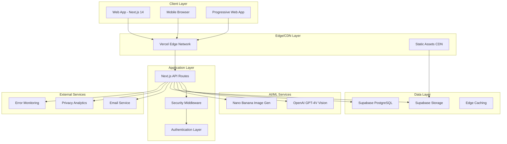
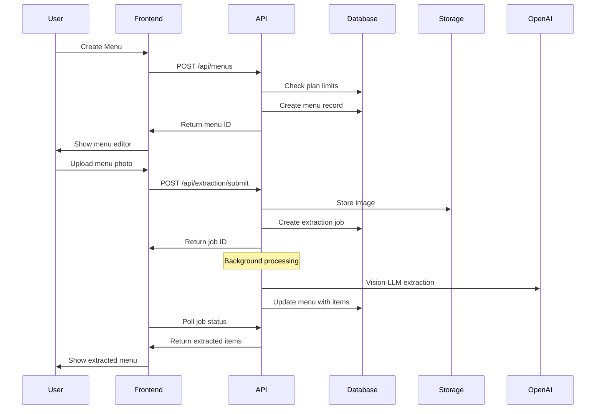
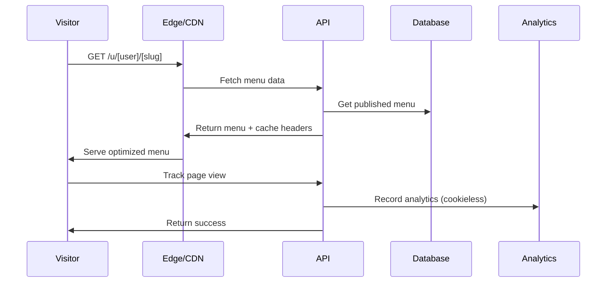
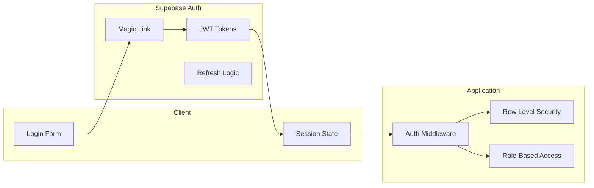
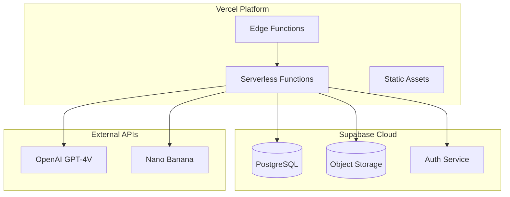

# GridMenu - Architecture Overview

## Executive Summary

GridMenu is a mobile-first digital menu platform that transforms paper menus into beautiful, responsive digital menus using AI-powered vision technology. The system uses grid-based layouts to create professional menu presentations with AI-extracted content and generated food images. Built on a modern serverless architecture with Next.js 14, Supabase, and OpenAI's GPT-4V for direct image-to-menu extraction.

## High-Level Architecture



## Core Components

### 1. Frontend Application (Next.js 14)

**Location:** `src/app/`

**Architecture:** App Router with Server Components

**Key Features:**
- Mobile-first responsive design
- Progressive Web App capabilities
- Server-side rendering for SEO
- Client-side routing for SPA experience
- Tailwind CSS design system

**Main Routes:**
- `/` - Landing page
- `/dashboard` - User dashboard
- `/dashboard/menus/[menuId]` - Menu editor
- `/u/[userId]/[slug]` - Public menu viewer
- `/admin/*` - Admin dashboard
- `/auth/*` - Authentication flows

### 2. API Layer (Next.js API Routes)

**Location:** `src/app/api/`

**Architecture:** RESTful API with serverless functions

**Core Endpoints:**
- `/api/menus/*` - Menu CRUD operations
- `/api/extraction/*` - AI menu extraction
- `/api/generate-image/*` - AI image generation
- `/api/templates/*` - Menu template exports
- `/api/analytics/*` - Privacy-friendly analytics
- `/api/admin/*` - Admin operations

### 3. Authentication & Authorization

**Implementation:** Supabase Auth + Custom Role System

**Features:**
- Magic link authentication
- Role-based access control (user/admin)
- Session management
- CSRF protection
- Rate limiting

**Security Middleware:** `src/middleware.ts`
- IP-based rate limiting
- CSRF token validation
- Request sanitization

### 4. Data Layer

**Primary Database:** Supabase PostgreSQL

**Key Tables:**
- `profiles` - User profiles and plan limits
- `menus` - Menu metadata and versioning
- `menu_versions` - Menu version history
- `menu_analytics` - Privacy-friendly analytics
- `image_generation_jobs` - AI image generation tracking
- `menu_extraction_jobs` - AI extraction processing jobs

**Storage:** Supabase Storage
- Menu images
- Generated AI images
- Export files (PDF, images)
- QR codes (optional sharing feature)

### 5. AI/ML Pipeline

**Menu Extraction Service:** `src/lib/extraction/`

**Single-Stage Vision-LLM Processing:**
- Direct image-to-structured-data using OpenAI GPT-4V
- Two schema versions: stage1 (basic items) and stage2 (advanced with variants/modifiers)
- No separate OCR step required

**Image Generation:** `src/lib/nano-banana.ts`
- AI-powered food image generation
- Multiple style variations
- Quota management
- Batch processing

### 6. Template System

**Location:** `src/lib/templates/`

**Features:**
- Grid-based menu layouts
- PDF/Image export
- Responsive design tokens
- Performance optimization

**Note:** Theme customization UI is planned but not yet implemented.

## Data Flow Architecture

### Menu Creation Flow



### Public Menu Access Flow



## Security Architecture

### Authentication Flow



### Security Features

1. **Authentication:**
   - Magic link authentication (passwordless)
   - JWT token management
   - Automatic session refresh

2. **Authorization:**
   - Row-level security (RLS) policies
   - Role-based access control
   - Plan-based feature limits

3. **Request Security:**
   - CSRF protection
   - Rate limiting (IP-based)
   - Input sanitization
   - SQL injection prevention

4. **Data Protection:**
   - Cookieless analytics
   - No PII collection
   - GDPR/PDPA compliance
   - Automatic data cleanup

## Performance Architecture

### Optimization Strategy

1. **Frontend Performance:**
   - Server-side rendering
   - Static generation where possible
   - Image optimization (WebP, responsive)
   - Code splitting and lazy loading
   - Performance budget: ≤130KB initial payload

2. **API Performance:**
   - Edge caching (Vercel)
   - Database query optimization
   - Connection pooling
   - Background job processing

3. **Storage Performance:**
   - CDN distribution
   - Image compression
   - Lazy loading
   - Progressive enhancement

### Performance Targets

- **Initial Load:** ≤130KB payload, ≤3s TTFP on 4G
- **AI Extraction Processing:** p50 ≤20s, p95 ≤60s
- **Menu Availability:** 99.9% uptime
- **Concurrent Users:** 1000+ simultaneous menu views

## Deployment Architecture

### Production Environment



### Infrastructure Components

1. **Frontend Hosting:** Vercel
   - Global CDN
   - Edge functions
   - Automatic deployments
   - Preview environments

2. **Backend Services:** Supabase
   - Managed PostgreSQL
   - Real-time subscriptions
   - Object storage
   - Authentication service

3. **AI Services:**
   - OpenAI GPT-4V (vision-based menu extraction)
   - Nano Banana (AI food image generation)

## Feature Architecture

### Admin Dashboard

**Location:** `src/app/admin/`

**Components:**
- Analytics overview
- Extraction metrics
- Cost monitoring
- User management
- System health

**Access Control:** Role-based (admin only)

### Menu Management

**Core Features:**
- CRUD operations
- Version control
- Publishing workflow
- Grid-based menu layouts
- Basic payment info display (PayNow QR codes)

**Planned Features:**
- Advanced theme customization UI
- Enhanced payment processing integration

**Data Model:** Hybrid flat/hierarchical structure for backward compatibility

### AI Processing Pipeline

**Extraction Service:** `src/lib/extraction/`

**Features:**
- Single-stage vision-LLM processing
- Two schema versions (stage1/stage2)
- Error handling and retries
- Cost monitoring
- Quality metrics
- Feedback collection

**Image Generation:** `src/components/AIImageGeneration.tsx`

**Features:**
- Style customization
- Batch processing
- Quota management
- Variation selection

### Template System

**Location:** `src/lib/templates/`

**Export Formats:**
- PDF (print-ready menus)
- PNG/JPEG (social media sharing)
- HTML (web embedding)
- QR codes (optional sharing method)

**Current Capabilities:**
- Grid layouts
- Responsive breakpoints
- Basic color themes

**Planned Capabilities:**
- Advanced theme customization
- Typography controls

## Integration Architecture

### External Service Integration

1. **OpenAI GPT-4V API**
   - Direct image-to-menu extraction
   - Structured data extraction
   - Token usage tracking
   - Error handling and retries
   - Cost optimization

2. **Nano Banana API**
   - AI food image generation
   - Style parameters
   - Batch processing
   - Quality control
   - Quota management

### Database Integration

**ORM Strategy:** Direct Supabase client usage

**Key Patterns:**
- Repository pattern for data access
- Transaction management
- Connection pooling
- Query optimization

## Monitoring & Observability

### Analytics Implementation

**Privacy-First Approach:**
- Cookieless tracking
- Rotating visitor IDs
- No PII collection
- GDPR/PDPA compliant

**Metrics Collected:**
- Page views
- Unique visitors (estimated)
- Processing times
- Error rates
- Cost tracking

### Error Handling

**Strategy:**
- Graceful degradation
- User-friendly error messages
- Automatic retries
- Fallback mechanisms

**Monitoring:**
- Application errors
- API failures
- Performance metrics
- Security events

## Scalability Considerations

### Current Limitations

1. **In-Memory Rate Limiting:** Resets on serverless cold starts
2. **Single Region:** No multi-region deployment
3. **Manual Scaling:** No auto-scaling for AI processing

### Scaling Strategy

1. **Horizontal Scaling:**
   - Serverless functions auto-scale
   - Database connection pooling
   - CDN distribution

2. **Performance Optimization:**
   - Edge caching
   - Background job processing
   - Database query optimization

3. **Cost Management:**
   - Plan-based limits
   - Usage monitoring
   - Automatic quota enforcement

## Development Workflow

### Code Organization

```
src/
├── app/                 # Next.js 14 app directory
│   ├── api/            # API routes
│   ├── dashboard/      # User dashboard
│   ├── admin/          # Admin interface
│   └── u/              # Public menus
├── components/         # React components
│   ├── ui/            # Base UI components
│   ├── admin/         # Admin components
│   └── templates/     # Template components
├── lib/               # Utility libraries
│   ├── extraction/    # AI extraction service
│   ├── templates/     # Template system
│   └── *.ts          # Core utilities
└── types/             # TypeScript definitions
```

### Testing Strategy

**Test Categories:**
- Unit tests (Jest)
- Integration tests
- E2E tests (critical journeys)
- Performance tests
- Accessibility tests (WCAG 2.1 AA)
- Load tests

**Coverage Goals:**
- Overall: 80% minimum
- Critical paths: 95% minimum

### Deployment Pipeline

1. **Development:** Local development with hot reload
2. **Testing:** Automated test suite
3. **Staging:** Preview deployments on Vercel
4. **Production:** Automatic deployment on merge

## Future Architecture Considerations

### Planned Enhancements

1. **Multi-Region Deployment**
   - Global edge distribution
   - Regional data compliance
   - Improved performance

2. **Advanced AI Features**
   - Real-time menu updates
   - Inventory management
   - Price optimization

3. **Enhanced Analytics**
   - Advanced reporting
   - Business intelligence
   - Predictive analytics

4. **Mobile Applications**
   - Native iOS/Android apps
   - Offline capabilities
   - Push notifications

### Technical Debt

1. **Data Migration:** Ongoing backward compatibility needs between flat items and hierarchical categories
2. **Testing Coverage:** Some areas need more comprehensive testing
3. **Documentation:** Aligned as of Nov 4, 2025; schedule quarterly audits to prevent drift

## Conclusion

GridMenu represents a well-architected, modern web application that successfully balances performance, security, and user experience. The serverless architecture provides excellent scalability, while the AI-powered extraction and image generation features differentiate it from traditional menu solutions.

The system's strength lies in its mobile-first approach, grid-based layout system, privacy-conscious design, and comprehensive feature set that addresses real restaurant owner needs. The modular architecture allows for future enhancements while maintaining backward compatibility.

Key architectural decisions like the hybrid data model, single-stage vision-LLM processing, grid-based templates, and cookieless analytics demonstrate thoughtful engineering that prioritizes both technical excellence and regulatory compliance.

---

**Document Version:** 1.1  
**Last Updated:** November 4, 2025  
**Maintained By:** Development Team